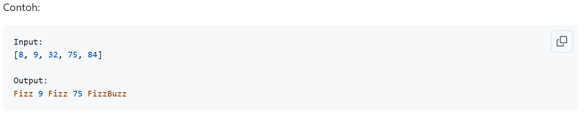
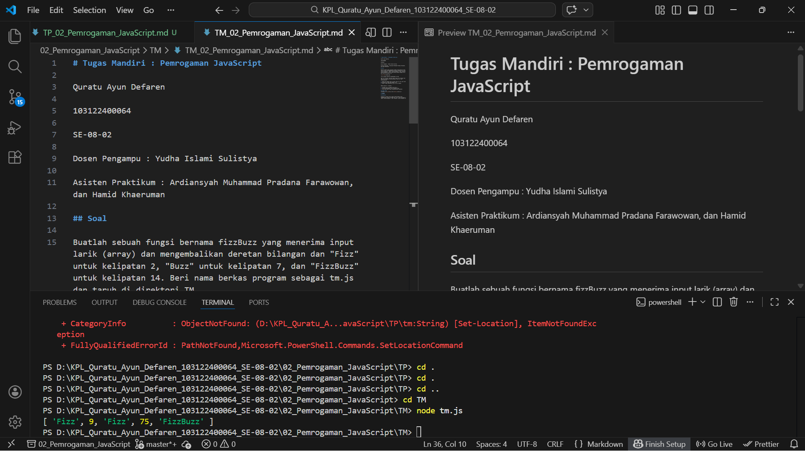

# Tugas Mandiri : Pemrogaman JavaScript

Quratu Ayun Defaren

103122400064

SE-08-02

Dosen Pengampu : Yudha Islami Sulistya

Asisten Praktikum : Ardiansyah Muhammad Pradana Farawowan, dan Hamid Khaeruman 

## Soal

Buatlah sebuah fungsi bernama fizzBuzz yang menerima input larik (array) dan mengembalikan deretan bilangan dan "Fizz" untuk kelipatan 2, "Buzz" untuk kelipatan 7, dan "FizzBuzz" untuk kelipatan 14. Beri nama berkas program sebagai tm.js dan taruh di direktori TM.

(Tip: Gunakan operator penyambungan string)

Agar bisa dinilai, pastikan bahwa fungsi bisa diekspor dan lolos uji. Berkas uji bisa dilihat di test.js. Cara menjalankannya:

1. Unduh dulu berkas test.js (bisa lihat di sini) dan taruh di direktori TM yang sama dengan tm.js.
2. Ekspor fungsi yang kamu tulis di tm.js dengan:

...
module.exports = fizzBuzz;

3. Jalankan test.js dengan node test.js
4. Jika ada yang gagal lolos, perbaiki lagi
5. Jika sudah benar semua, dokumentasikan outputnya

## Sumber Kode
Tersedia di [tm.js](tm.js) dan [test.js](test.js)

## Output

## Deskripsi

Program ini terdiri dari fungsi yang bertugas untuk mengembalikan deretan bilangan dan "Fizz" untuk kelipatan 2, "Buzz" untuk kelipatan 7, dan "FizzBuzz" untuk kelipatan 14.