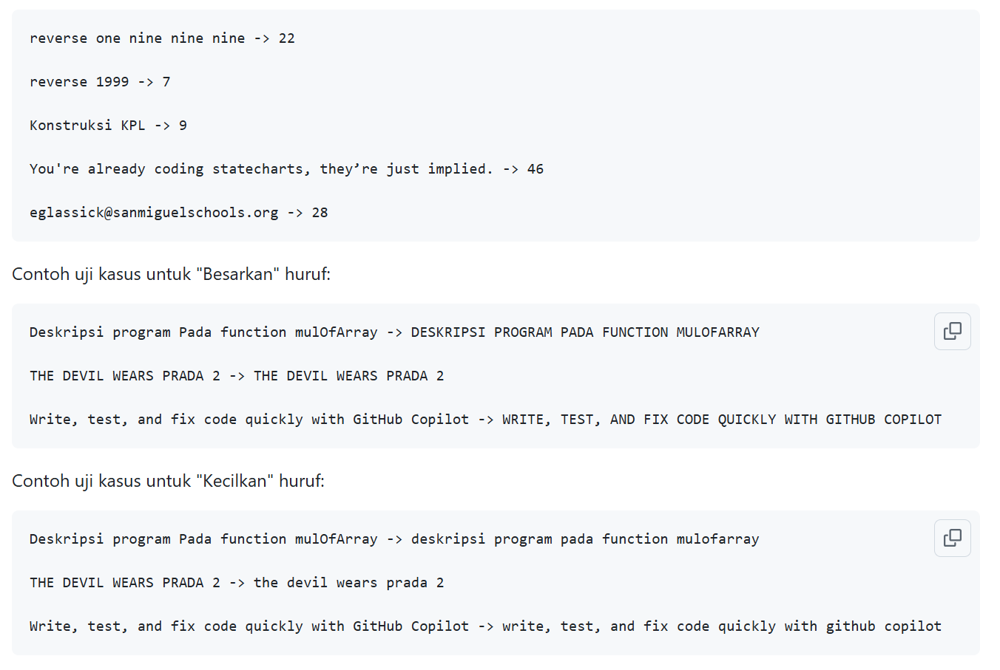
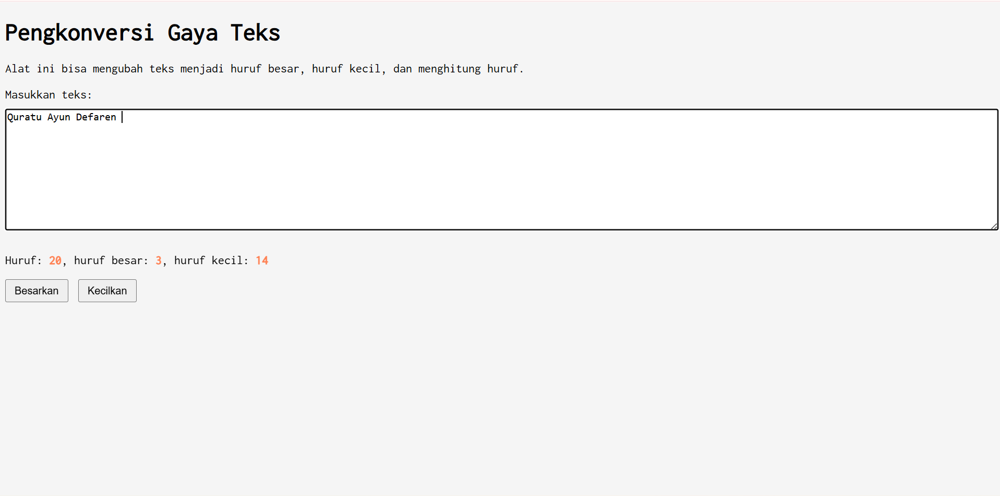

# Tugas Mandiri : GUI dengan HTML dan CSS

Quratu Ayun Defaren

103122400064

SE-08-02

Dosen Pengampu : Yudha Islami Sulistya

Asisten Praktikum : Ardiansyah Muhammad Pradana Farawowan, dan Hamid Khaeruman 

## Soal

Setelah kamu menyelesaikan tugas pendahuluan (bisa buka di atas), terapkanlah fungsi untuk (1) menghitung huruf kecil yang disediakan di #hk, (2) mengubah huruf kecil ke huruf besar ketika pengguna menekan tombol #huruf-besar, dan (3) mengubah huruf besar ke huruf kecil ketika pengguna menekan tombol #huruf-kecil.
Untuk nomor 2 dan 3, tampilkan hasilnya di dalam editor-kecil.
Kemudian, hapuslah fitur "Paragrafkan" dari alat.

## Sumber Kode

Tersedia di [index.html](./index.html), [index.css](./index.css), dan [index.js](./index.js)

## Output

## Deskripsi

Program ini mengkonversi button [Besarkan] untuk meng-capslock kata-kata yang sudah diinputkan didalam kotak teks, [Kecilkan] untuk mengubah kata-kata tersebut huruf kecil semua

Program ini juga bisa menghitung jumlah huruf [huruf = ...] baik huruf besar,maupun huruf kecil, maupun simbol. lalu [huruf besar = ...] untuk menghitung huruf besarnya saja, dan yang terakhir [huruf kecil = ...] untuk menghitung jumlah huruf kecil pada kata-kata