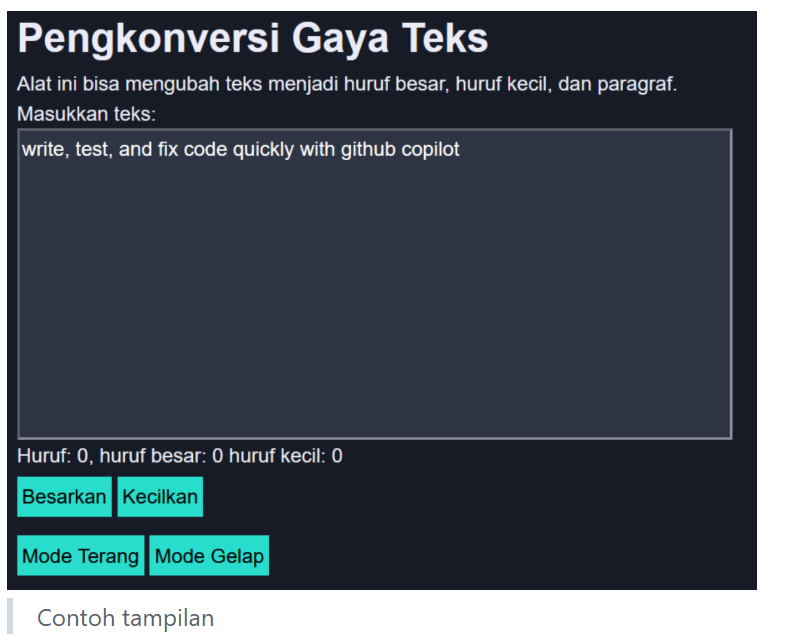
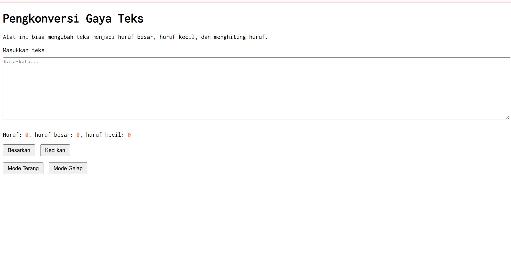
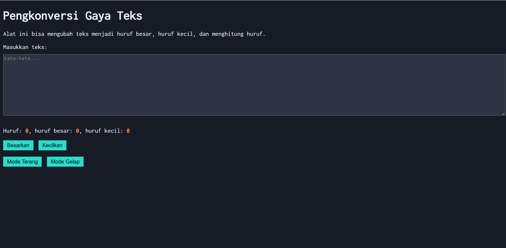

# Tugas Pendahuluan : Automata dan Table-Driven Construction

Quratu Ayun Defaren

103122400064

SE-08-02

Dosen Pengampu : Yudha Islami Sulistya

Asisten Praktikum : Ardiansyah Muhammad Pradana Farawowan, dan Hamid Khaeruman 

## Soal

Tambahkan mode gelap sekaligus untuk editor-kecil dan tombol-tombolnya. Ketentuan warna untuk latar belakang editor-kecil adalah #2e3443, sementara untuk tombol adalah #29ddcc. Teks untuk tombol tetap mengikuti warna teks sebelumnya.

Untuk menghapus pinggiran tombol, nyatakan properti border untuk tidak ditunjukkan.

## Sumber Kode

Tersedia di [index.html](index.html), [index.css](index.css), dan [index.js](index.js)

## Output

## Deskripsi

program ini selain mengkonversi gaya teks, juga terdapat fitur mode gelap sehingga pengguna bisa menggunakannya di malam hari

cukup dengan click tombol [Mode Gelap], maka akan langsung berubah ke mode gelap. Jika mau mengubah ke mode terang lagi, click tombol [Mode Terang] maka akan berubah ke mode terang kembali.