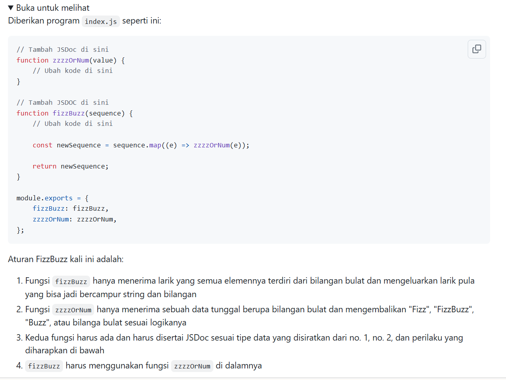
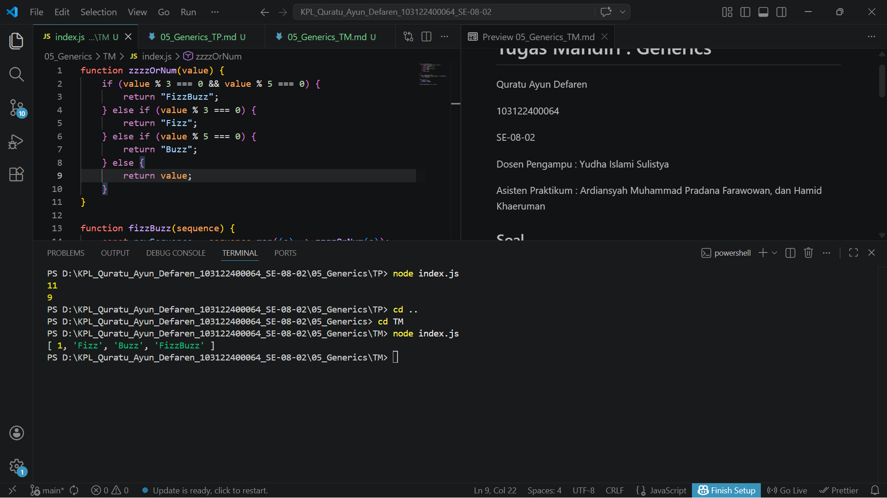

# Tugas Mandiri : Generics

Quratu Ayun Defaren

103122400064

SE-08-02

Dosen Pengampu : Yudha Islami Sulistya

Asisten Praktikum : Ardiansyah Muhammad Pradana Farawowan, dan Hamid Khaeruman 

## Soal

## Sumber Kode

Tersedia di [index.js](index.js)

## Output

## Deskripsi

Kode tersebut mengimplementasikan logika **FizzBuzz** menggunakan dua fungsi. Fungsi `zzzzOrNum` menerima satu bilangan dan mengembalikan `"Fizz"` jika habis dibagi 3, `"Buzz"` jika habis dibagi 5, `"FizzBuzz"` jika habis dibagi keduanya, atau angka itu sendiri jika tidak memenuhi kondisi. Fungsi `fizzBuzz` menerima array berisi bilangan, lalu menggunakan `map()` untuk memproses setiap elemen dengan fungsi `zzzzOrNum` dan menghasilkan array baru yang berisi kombinasi angka dan string sesuai aturan FizzBuzz. Hasil akhirnya ditampilkan menggunakan `console.log`.
