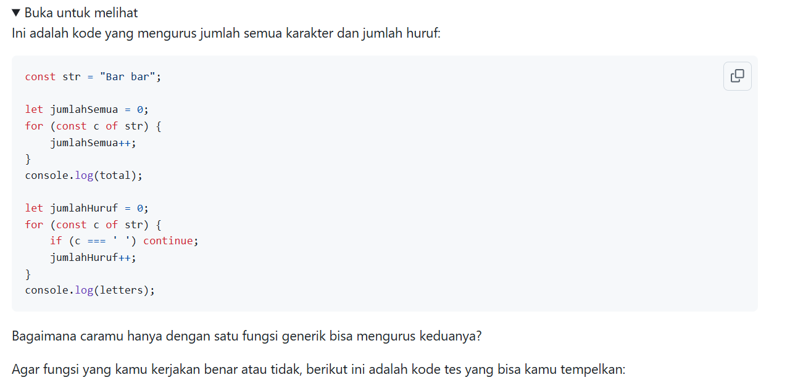
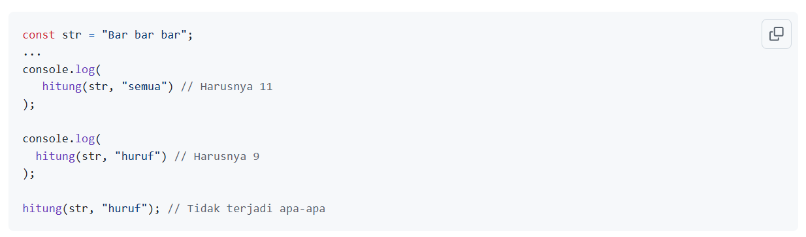
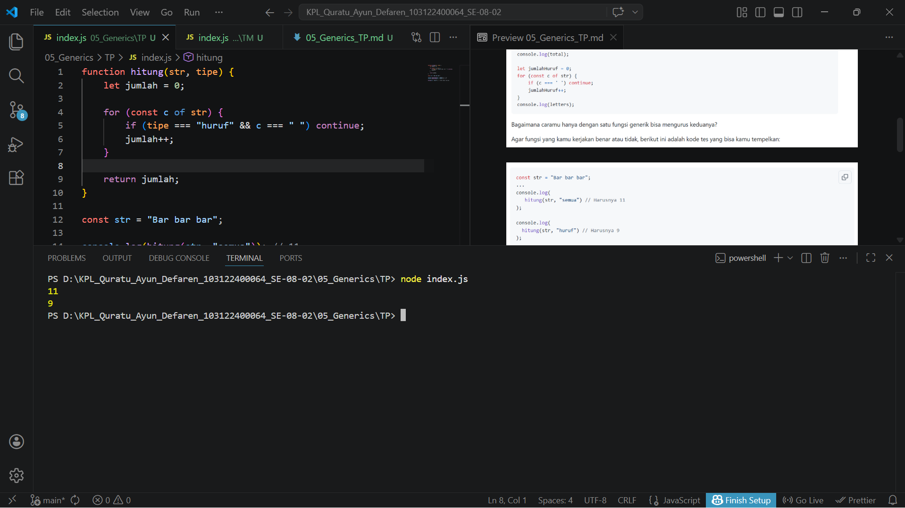

# Tugas Pendahuluan : Generics

Quratu Ayun Defaren

103122400064

SE-08-02

Dosen Pengampu : Yudha Islami Sulistya

Asisten Praktikum : Ardiansyah Muhammad Pradana Farawowan, dan Hamid Khaeruman 

## Soal

## Sumber Kode

Tersedia di [index.js](index.js)

## Output

## Deskripsi

Kode tersebut membuat sebuah fungsi bernama `hitung` yang digunakan untuk menghitung jumlah karakter dalam sebuah string berdasarkan tipe yang diberikan. Fungsi menerima dua parameter, yaitu `str` (teks yang ingin dihitung) dan tipe (jenis perhitungan: `"semua"` atau `"huruf"`). Di dalam fungsi, dilakukan perulangan untuk membaca setiap karakter. Jika tipe `"huruf"` dipilih, maka karakter spasi akan dilewati, sehingga hanya huruf yang dihitung. Jika tipe `"semua"`, maka seluruh karakter termasuk spasi akan dihitung. Hasil perhitungan kemudian dikembalikan dan ditampilkan menggunakan console.log.