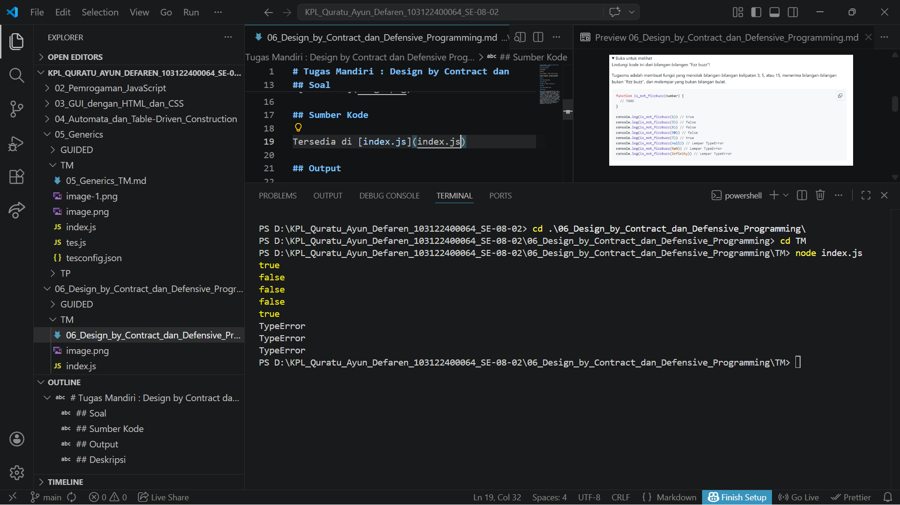

# Tugas Mandiri : Design by Contract dan Defensive Programming

Quratu Ayun Defaren

103122400064

SE-08-02

Dosen Pengampu : Yudha Islami Sulistya

Asisten Praktikum : Ardiansyah Muhammad Pradana Farawowan, dan Hamid Khaeruman 

## Soal

## Sumber Kode

Tersedia di [index.js](index.js)

## Output

## Deskripsi

Program ini bertujuan untuk mengimplementasikan sebuah fungsi bernama is_not_fizzbuzz yang digunakan untuk menentukan apakah suatu bilangan bukan termasuk kategori "fizz buzz". Dalam konteks ini, bilangan "fizz buzz" didefinisikan sebagai bilangan yang merupakan kelipatan 3, 5, atau keduanya (15).

Fungsi menerima satu parameter berupa sebuah nilai numerik. Program menerapkan konsep defensive programming dengan melakukan validasi terhadap input yang diberikan. Jika input yang diterima bukan merupakan bilangan bulat (integer), maka fungsi akan melempar (throw) sebuah TypeError sebagai bentuk penanganan kesalahan.

Apabila input valid, maka fungsi akan melakukan pengecekan:

1. Jika bilangan merupakan kelipatan 3 atau 5, maka fungsi mengembalikan nilai false (karena termasuk "fizz buzz").
2. Jika bilangan bukan kelipatan 3 maupun 5, maka fungsi mengembalikan nilai true (bukan "fizz buzz").

Selain itu, dalam pengujian program digunakan struktur try-catch untuk menangani error yang mungkin terjadi, sehingga proses eksekusi program tidak berhenti secara tiba-tiba dan seluruh skenario pengujian dapat dijalankan.