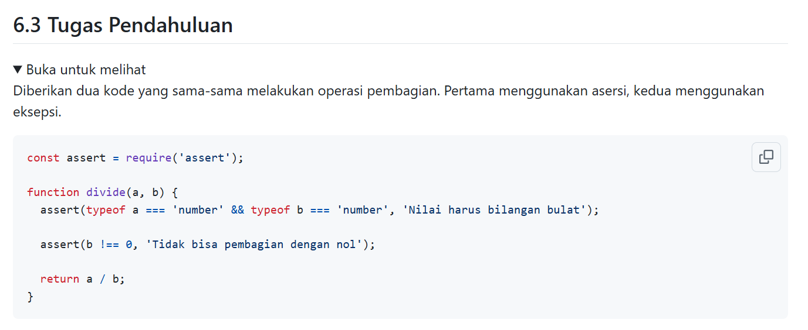
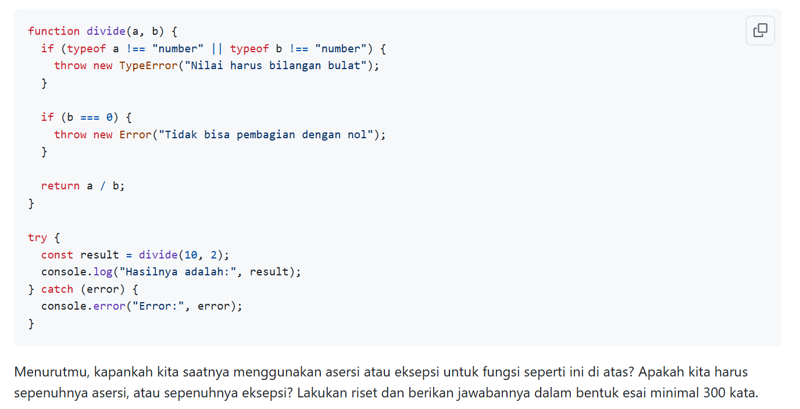

# Tugas Pendahuluan : Design by Contract dan Defensive Programming

Quratu Ayun Defaren

103122400064

SE-08-02

Dosen Pengampu : Yudha Islami Sulistya

Asisten Praktikum : Ardiansyah Muhammad Pradana Farawowan, dan Hamid Khaeruman 

## Soal

## Jawaban

Dalam pengembangan perangkat lunak, penggunaan asersi (assertion) dan eksepsi (exception) memiliki tujuan yang berbeda meskipun keduanya sama-sama digunakan untuk menangani kesalahan. Pada contoh fungsi divide(a, b) di atas, kita bisa melihat dua pendekatan: satu menggunakan asersi untuk validasi, dan satu lagi menggunakan eksepsi.

Asersi umumnya digunakan untuk memastikan kondisi yang seharusnya selalu benar selama program berjalan. Konsep ini berkaitan erat dengan Design by Contract, khususnya pada bagian prakondisi (precondition). Misalnya, dalam fungsi divide, asumsi bahwa a dan b harus bertipe number dan b tidak boleh nol merupakan kondisi yang diharapkan benar jika fungsi digunakan dengan benar oleh programmer. Jika kondisi ini gagal, maka berarti ada bug dalam kode yang memanggil fungsi tersebut, bukan kesalahan dari pengguna akhir. Oleh karena itu, asersi lebih cocok digunakan selama tahap pengembangan dan debugging. Bahkan dalam banyak bahasa atau lingkungan produksi, asersi sering dinonaktifkan untuk meningkatkan performa.

Di sisi lain, eksepsi digunakan untuk menangani kondisi error yang mungkin terjadi saat runtime dan perlu ditangani secara eksplisit. Ini sejalan dengan konsep Defensive Programming, di mana program harus mampu menghadapi berbagai kemungkinan input yang tidak valid atau kondisi tak terduga. Dalam kasus fungsi divide, jika fungsi tersebut digunakan sebagai bagian dari API publik atau menerima input dari pengguna (misalnya dari form atau request), maka validasi menggunakan eksepsi lebih tepat. Dengan melempar TypeError atau Error, program memberikan kesempatan bagi pemanggil fungsi untuk menangani kesalahan tersebut, seperti menampilkan pesan error atau melakukan fallback.

Dengan demikian, tidak disarankan untuk memilih sepenuhnya asersi atau sepenuhnya eksepsi, melainkan menggunakan keduanya secara bijak sesuai konteks. Asersi digunakan untuk mendeteksi kesalahan logika internal selama pengembangan, sedangkan eksepsi digunakan untuk menangani kesalahan yang mungkin terjadi dalam penggunaan nyata (runtime), terutama yang berasal dari input eksternal.

Pendekatan terbaik adalah kombinasi keduanya:

Gunakan asersi untuk memastikan kontrak internal antar komponen terpenuhi.
Gunakan eksepsi untuk menangani error yang dapat terjadi dan perlu direspon oleh sistem.

Dengan strategi ini, kode menjadi lebih aman, mudah diuji, dan lebih robust dalam menghadapi berbagai kondisi.