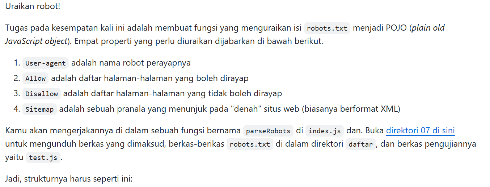
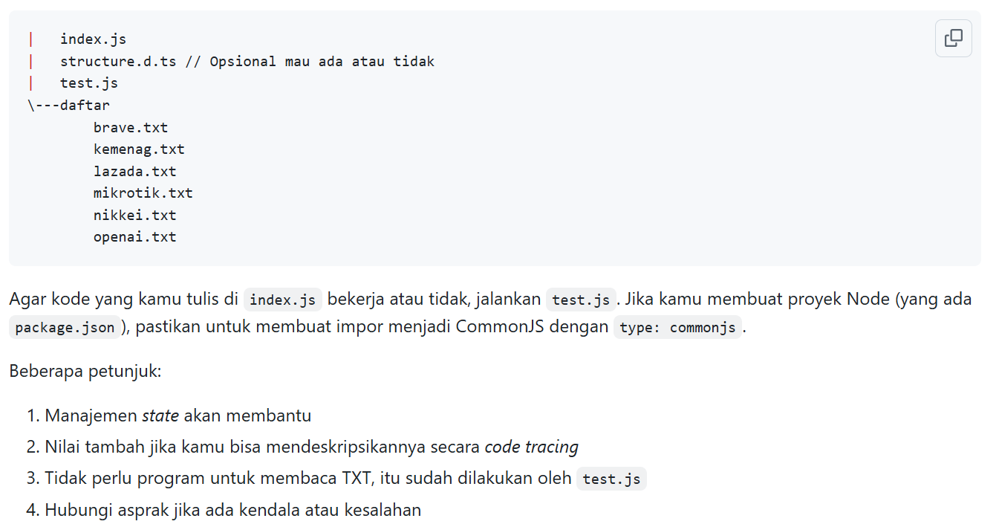
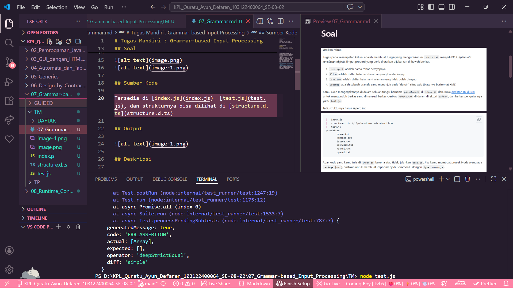
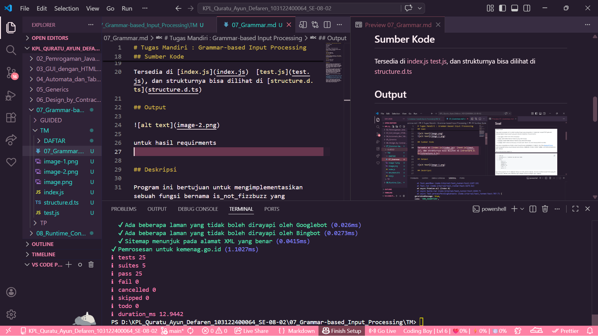

# Tugas Mandiri : Grammar-based Input Processing

Quratu Ayun Defaren

103122400064

SE-08-02

Dosen Pengampu : Yudha Islami Sulistya

Asisten Praktikum : Ardiansyah Muhammad Pradana Farawowan, dan Hamid Khaeruman 

## Soal

## Sumber Kode

Tersedia di [index.js](index.js)  [test.js](test.js), dan strukturnya bisa dilihat di [structure.d.ts](structure.d.ts)

## Output

untuk hasil requirments

## Deskripsi

Pada tugas ini, dilakukan implementasi sebuah fungsi bernama parseRobots yang bertujuan untuk menguraikan isi file robots.txt menjadi sebuah struktur data berbentuk POJO (Plain Old JavaScript Object).

File robots.txt merupakan standar yang digunakan oleh website untuk memberikan instruksi kepada robot perayap (web crawler) mengenai halaman mana yang boleh atau tidak boleh diakses. Oleh karena itu, diperlukan proses parsing agar informasi tersebut dapat diolah secara terstruktur oleh program.

Fungsi parseRobots bekerja dengan membaca teks robots.txt baris per baris, kemudian mengidentifikasi beberapa komponen utama, yaitu:

User-agent: Menunjukkan nama robot perayap (misalnya *, Googlebot, Bingbot)
Allow: Daftar path yang diizinkan untuk dirayapi
Disallow: Daftar path yang dilarang untuk dirayapi
Sitemap: URL yang menunjuk ke peta situs (biasanya dalam format XML)
Host (opsional): Domain utama dari situs

Dalam prosesnya, fungsi ini menerapkan konsep state management, yaitu dengan menyimpan user-agent yang sedang aktif agar setiap aturan Allow dan Disallow dapat dikaitkan dengan agent yang tepat.

Hasil akhir dari parsing ini adalah sebuah objek JavaScript dengan struktur terorganisir, di mana setiap user-agent memiliki daftar aturan Allow dan Disallow masing-masing, serta daftar Sitemap yang tersedia.

Untuk memastikan kebenaran implementasi, dilakukan pengujian menggunakan file `test.js` yang mencakup berbagai kasus nyata dari beberapa situs. Hasil pengujian menunjukkan bahwa seluruh test berhasil dilalui, sehingga fungsi yang dibuat telah sesuai dengan spesifikasi yang diberikan.