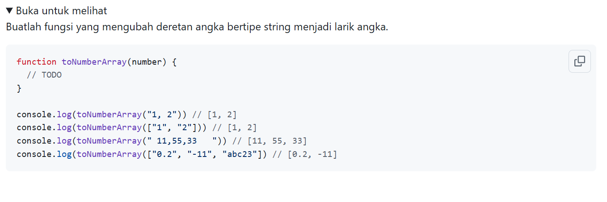
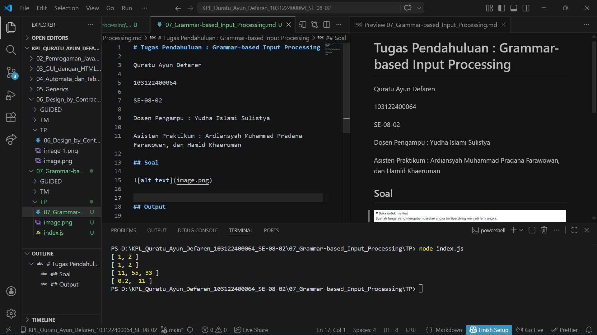

# Tugas Pendahuluan : Grammar-based Input Processing

Quratu Ayun Defaren

103122400064

SE-08-02

Dosen Pengampu : Yudha Islami Sulistya

Asisten Praktikum : Ardiansyah Muhammad Pradana Farawowan, dan Hamid Khaeruman 

## Soal

## Sumber Kode
Tersedia di [index.js](index.js)

## Output

## Deskripsi
Program ini bertujuan untuk mengimplementasikan fungsi toNumberArray yang digunakan untuk mengubah data masukan berupa deretan angka bertipe string atau array string menjadi sebuah larik (array) yang berisi nilai numerik.

Fungsi ini dirancang untuk menerima dua jenis input, yaitu:

1. String yang berisi angka-angka yang dipisahkan oleh tanda koma (,), misalnya "1, 2, 3".
2. Array of string, misalnya ["1", "2", "3"].

Dalam prosesnya, jika input berupa string, maka akan dilakukan pemisahan (splitting) berdasarkan tanda koma untuk menghasilkan array. Selanjutnya, setiap elemen akan dikonversi menjadi tipe data numerik menggunakan fungsi parseFloat().

Program juga menerapkan prinsip defensive programming, yaitu dengan melakukan penyaringan terhadap nilai yang tidak valid. Elemen yang tidak dapat dikonversi menjadi angka (misalnya "abc23") akan diabaikan dan tidak dimasukkan ke dalam hasil akhir.

Hasil dari fungsi ini adalah sebuah array yang hanya ber
