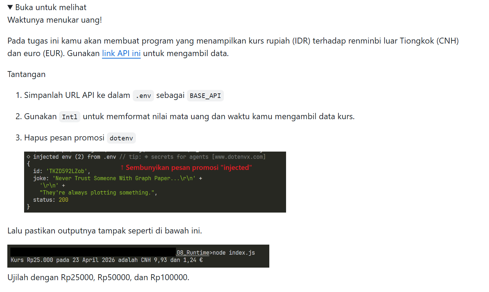
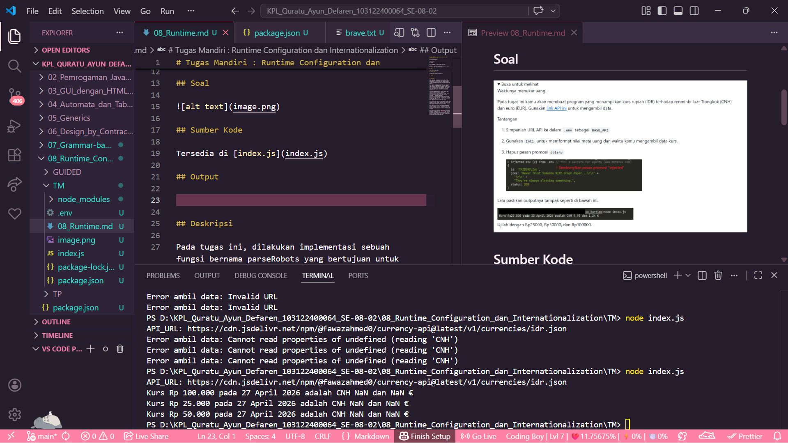

# Tugas Mandiri : Runtime Configuration dan Internationalization

Quratu Ayun Defaren

103122400064

SE-08-02

Dosen Pengampu : Yudha Islami Sulistya

Asisten Praktikum : Ardiansyah Muhammad Pradana Farawowan, dan Hamid Khaeruman 

## Soal

## Sumber Kode

Tersedia di [index.js](index.js)

## Output

## Deskripsi

Tugas ini bertujuan untuk mengimplementasikan konsep runtime configuration dan internationalization dalam aplikasi berbasis JavaScript (Node.js). Aplikasi yang dibuat memanfaatkan data dari API eksternal untuk menampilkan informasi kurs mata uang secara dinamis berdasarkan konfigurasi yang disimpan dalam file environment (`.env`).

Dalam implementasinya, aplikasi menggunakan library `dotenv` untuk membaca konfigurasi API dari environment variable, serta `axios` untuk melakukan HTTP request ke layanan penyedia data kurs. Data yang diperoleh kemudian diolah dan ditampilkan dalam format yang sesuai dengan standar lokal Indonesia, meliputi format mata uang (Rupiah), format angka desimal, dan format tanggal menggunakan `Intl` API.

Selain itu, aplikasi juga menerapkan konsep internationalization (i18n) dengan menyesuaikan tampilan output berdasarkan locale `id-ID`, sehingga hasil yang ditampilkan lebih mudah dipahami oleh pengguna di Indonesia. Program mampu melakukan konversi nilai Rupiah ke beberapa mata uang asing seperti Euro dan Yuan, serta menampilkan hasilnya secara terstruktur dan informatif.

Melalui tugas ini, mahasiswa diharapkan dapat memahami:

Cara mengelola konfigurasi aplikasi secara fleksibel menggunakan environment variables
Cara mengonsumsi dan mengolah data dari API eksternal
Penerapan internationalization dalam format angka, mata uang, dan tanggal
Penanganan error dalam proses pengambilan data (error handling)