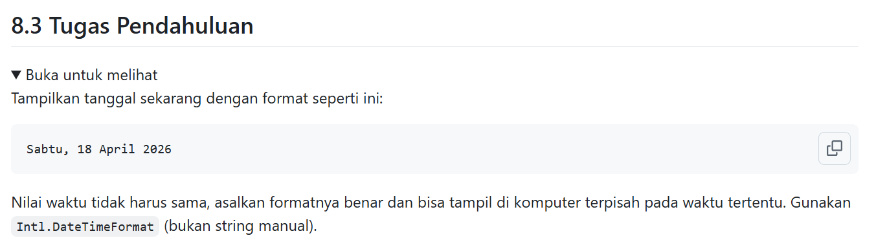
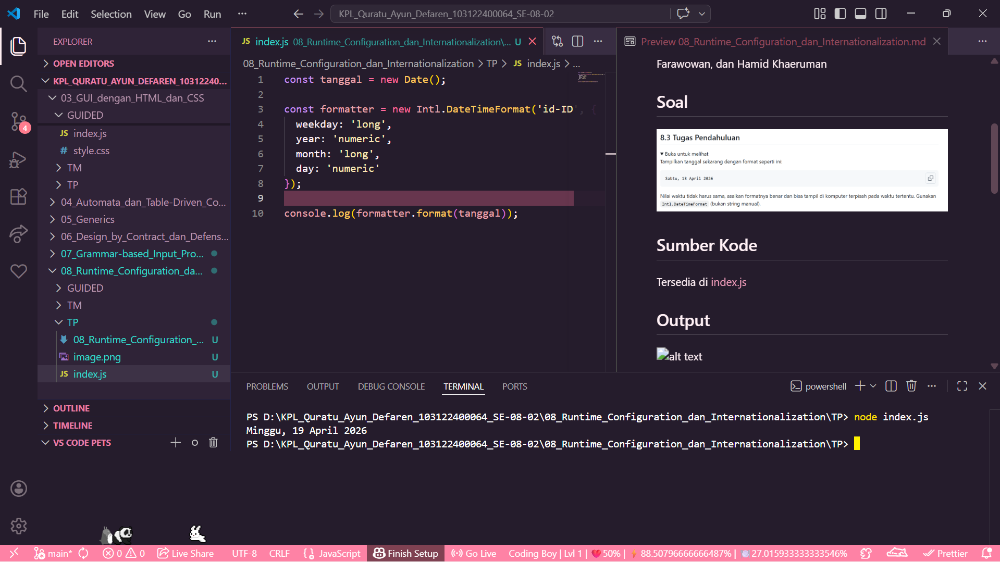

# Tugas Pendahuluan : Runtime Configuration dan Internationalization

Quratu Ayun Defaren

103122400064

SE-08-02

Dosen Pengampu : Yudha Islami Sulistya

Asisten Praktikum : Ardiansyah Muhammad Pradana Farawowan, dan Hamid Khaeruman 

## Soal

## Sumber Kode
Tersedia di [index.js](index.js)

## Output

## Deskripsi
`Intl.DateTimeFormat` digunakan untuk mengubah objek Date menjadi format yang lebih mudah dibaca oleh pengguna. Misalnya, tanggal yang awalnya berupa format default JavaScript dapat ditampilkan menjadi bentuk lengkap seperti `"Minggu, 19 April 2026"` atau disertai waktu seperti `"Minggu, 19 April 2026 pukul 10.30 WIB"`.

Penggunaan opsi seperti `dateStyle` dan `timeStyle` memungkinkan pengaturan tingkat kelengkapan informasi tanggal dan waktu (misalnya: full, long, medium, short). Selain itu, properti seperti weekday, year, month, dan day juga dapat digunakan untuk menyesuaikan format secara lebih spesifik sesuai kebutuhan sistem.