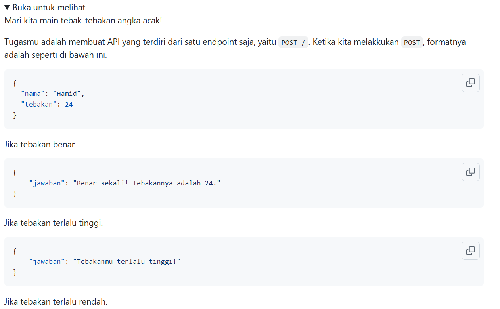
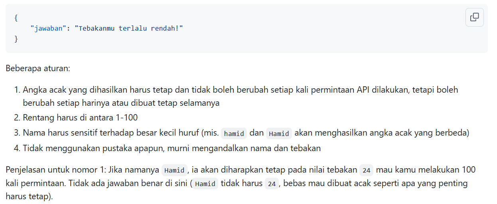
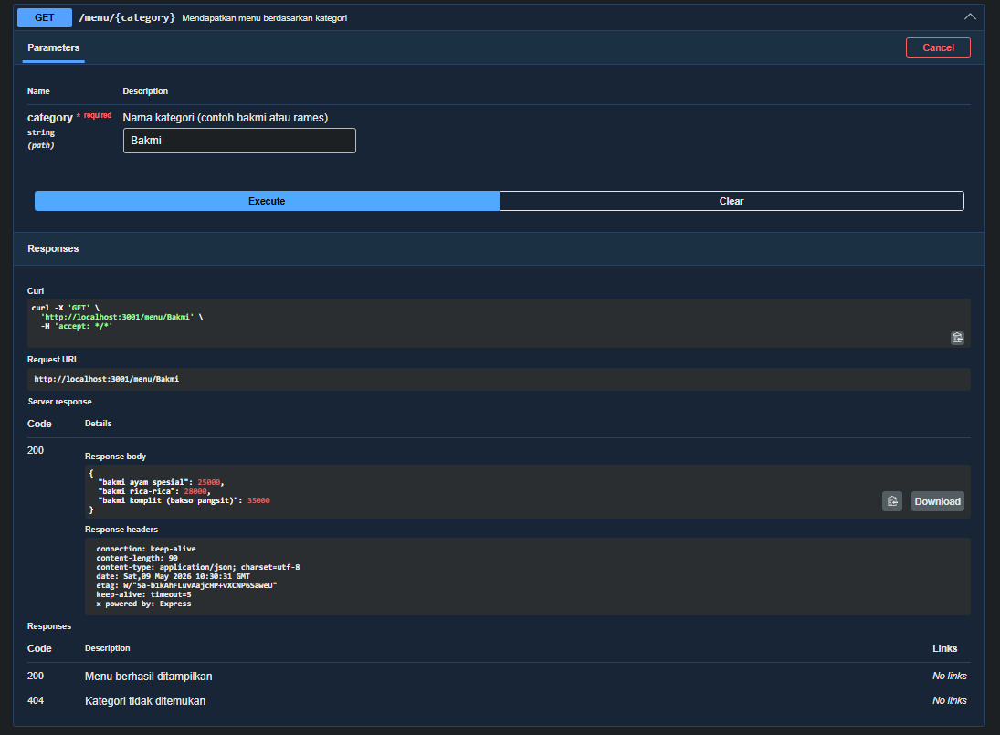

# Tugas Mandiri : API Design dan Construction Using Swagger

Quratu Ayun Defaren

103122400064

SE-08-02

Dosen Pengampu : Yudha Islami Sulistya

Asisten Praktikum : Ardiansyah Muhammad Pradana Farawowan, dan Hamid Khaeruman 

## Soal

## Sumber Kode

Tersedia di [index.js](index.js) dan [swagger.js](swagger.js)

## Output

## Deskripsi

Program ini merupakan API sederhana berbasis Node.js dan Express untuk permainan tebak angka. API menyediakan endpoint landing page dan endpoint `/tebak` yang memungkinkan pengguna menebak angka berdasarkan nama pemain. Angka rahasia dihasilkan dari perhitungan total nilai ASCII pada nama pengguna, kemudian sistem akan memberikan respon apakah tebakan terlalu rendah, terlalu tinggi, atau benar. Dokumentasi API dibuat menggunakan Swagger agar endpoint dapat diuji dan dipahami dengan lebih mudah.
