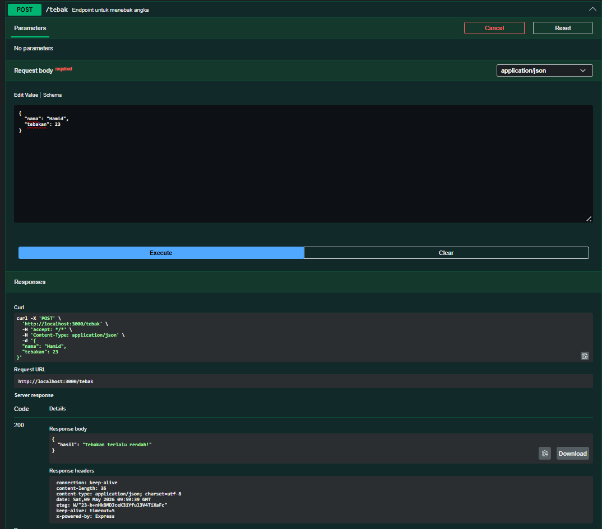

# Tugas Pendahuluan : API Design dan Construction Using Swagger

Quratu Ayun Defaren

103122400064

SE-08-02

Dosen Pengampu : Yudha Islami Sulistya

Asisten Praktikum : Ardiansyah Muhammad Pradana Farawowan, dan Hamid Khaeruman 

## Soal

## Sumber Kode
Tersedia di [index.js](index.js) dan [swagger.js](swagger.js)

## Output

## Deskripsi
Program ini merupakan API sederhana berbasis Node.js dan Express untuk menampilkan data menu makanan berdasarkan kategori. API menyediakan endpoint untuk melihat seluruh daftar menu serta endpoint `/menu/{category}` untuk mengambil menu sesuai kategori seperti bakmi atau rames. Data menu disimpan dalam bentuk objek JavaScript dan API akan memberikan respon JSON berisi nama menu beserta harga. Dokumentasi API dibuat menggunakan Swagger agar endpoint dapat diuji dan dipahami dengan lebih mudah.

