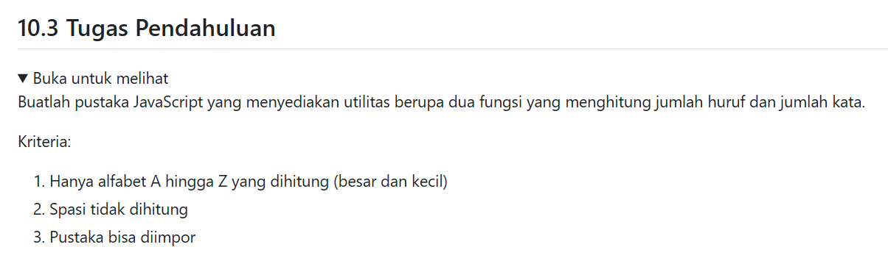
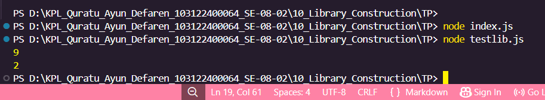

# Tugas Pendahuluan : Library Construction

Quratu Ayun Defaren

103122400064

SE-08-02

Dosen Pengampu : Yudha Islami Sulistya

Asisten Praktikum : Ardiansyah Muhammad Pradana Farawowan, dan Hamid Khaeruman 

## Soal

## Sumber Kode
Tersedia di [index.js](index.js) dan [testlib.js](testlib.js)

## Output

## Deskripsi
Kode tersebut merupakan contoh sederhana penggunaan JavaScript module dengan fungsi untuk menghitung jumlah huruf dan jumlah kata dalam sebuah string. File `index.js` berisi dua fungsi, yaitu `hitungHuruf()` untuk menghitung karakter alfabet dan `hitungKata()` untuk menghitung jumlah kata dalam kalimat. Sedangkan file `testlib.js` digunakan untuk mengimpor dan menguji fungsi tersebut menggunakan `console.log()`.
