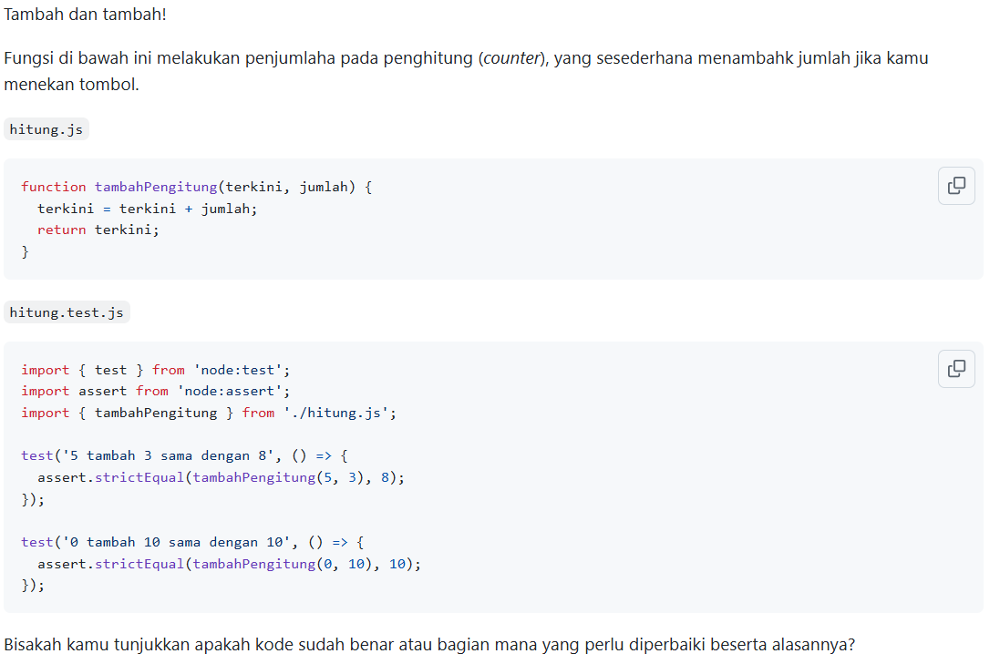
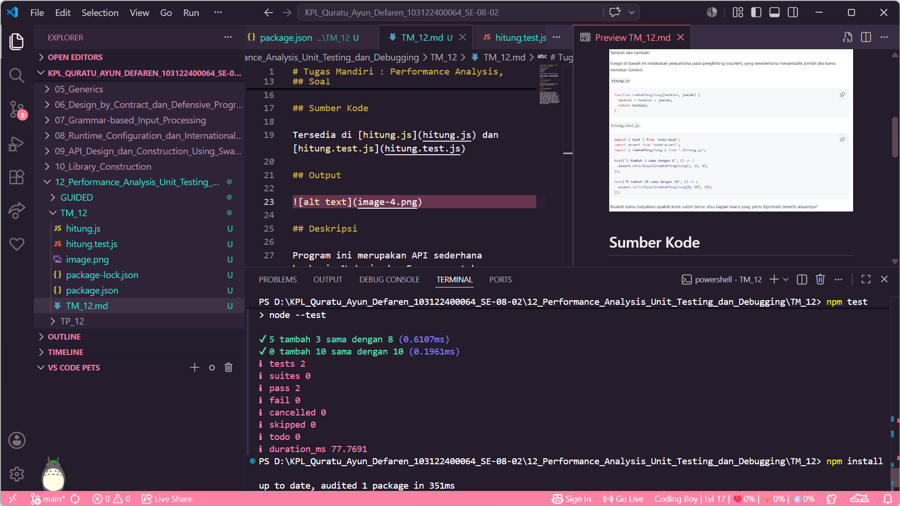

# Tugas Mandiri : Performance Analysis, Unit Testing, dan Debugging

Quratu Ayun Defaren

103122400064

SE-08-02

Dosen Pengampu : Yudha Islami Sulistya

Asisten Praktikum : Ardiansyah Muhammad Pradana Farawowan, dan Hamid Khaeruman 

## Soal

## Sumber Kode

Tersedia di [hitung.js](hitung.js) dan [hitung.test.js](hitung.test.js)

## Output

## Deskripsi

untuk kode pada file `hitung.test.js` sudah benar, kode di file `hitung.js` ada yang kuran yaitu belum ada penambahan `export` pada function `tambahPenghitung`