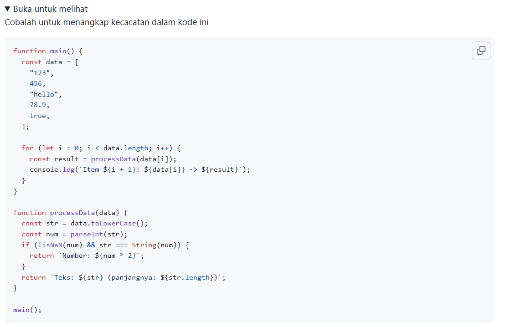
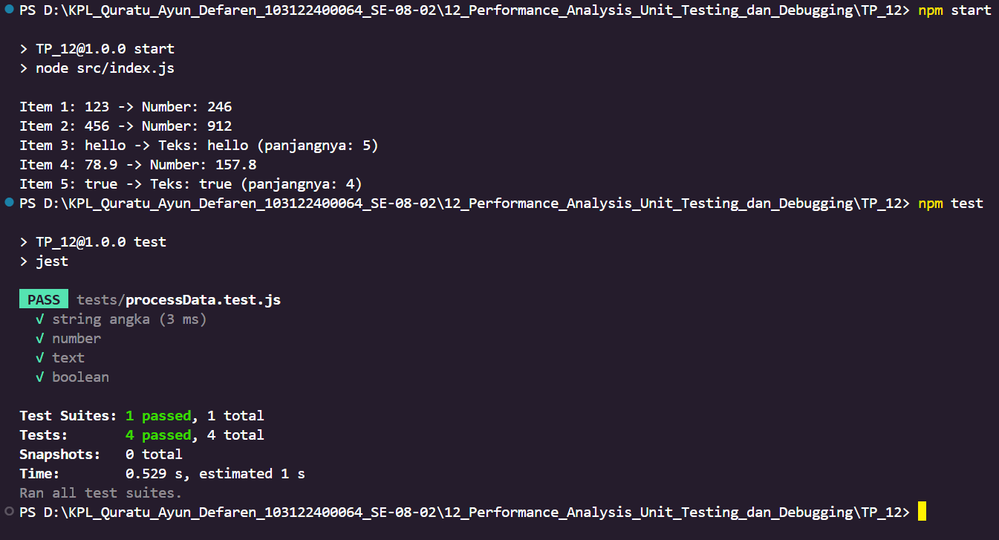

# Tugas Pendahuluan : Performance Analysis, Unit Testing, dan Debugging

Quratu Ayun Defaren

103122400064

SE-08-02

Dosen Pengampu : Yudha Islami Sulistya

Asisten Praktikum : Ardiansyah Muhammad Pradana Farawowan, dan Hamid Khaeruman 

## Soal

## Sumber Kode
Tersedia di folder `src` dan `tests`

## Output

## Deskripsi
Program ini dibuat menggunakan JavaScript dan Node.js untuk memproses berbagai tipe data seperti string, number, dan boolean. Program akan mengidentifikasi apakah data berupa angka atau teks, kemudian menampilkan hasil pemrosesan sesuai tipe datanya.
