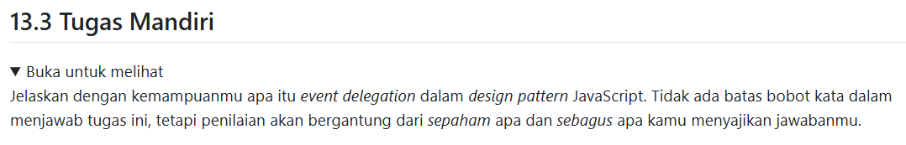

# Tugas Mandiri : Design Pattern Implementation

Quratu Ayun Defaren

103122400064

SE-08-02

Dosen Pengampu : Yudha Islami Sulistya

Asisten Praktikum : Ardiansyah Muhammad Pradana Farawowan, dan Hamid Khaeruman 

## Soal

## Penjelasan

even delegation merupakan pola pengelolaan event yang memusatkan kontrol seperti centralized event handling pada satu objek induk. setiap objek menangani eventnya sendiri, parent bertindak sebagai koordinator yang menerima event dan menenukan tindakan yang harus dilakukan berdasarkan sumber event tersebut.