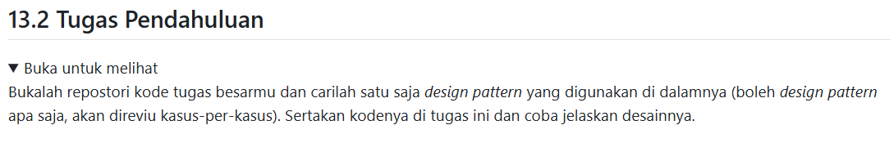

# Tugas Pendahuluan : Design Pattern Implementation

Quratu Ayun Defaren

103122400064

SE-08-02

Dosen Pengampu : Yudha Islami Sulistya

Asisten Praktikum : Ardiansyah Muhammad Pradana Farawowan, dan Hamid Khaeruman 

## Soal

## Implementasi MVC pada kode project tubes
1. Model

implementasi Model pada kode ini tersedia di [model.go](model.go) pada kode ini mempresentasikan tabel database, termasuk juga logika bisnis yang berada di layer model

2. View

untuk view kami menggunakan respon api, menggunakan postman

3. Controller

implementasi controleer pada kode ini ada pada [handler.go](handler.go) dan [route.go](route.go) pada kode ini bertugas untuk menerima request dari cilent, memvalidasi input, memanggil database, mengembalikan respon JSON, dll

jadi fungsi2 berikut ini merupakan controller:

`CreatePendonor()`

`GetPendonor()`

`DeletePendonor()`

`CreatePenerima()`

`GetPenerimas()`

`CreateMakanan()`

`GetMakanans()`

`CreateRequest()`

`GetRequests()`

untuk dokumennya ada [disini](Design%20Pattern%20KPL%20(3)_compressed.pdf)

