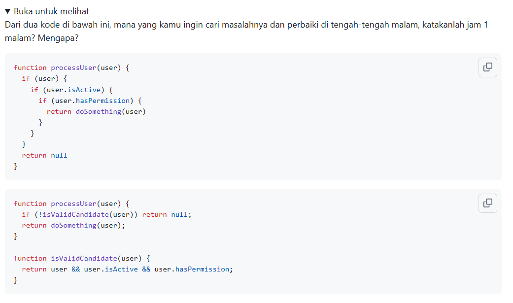

# Tugas Mandiri : Clean Code

Quratu Ayun Defaren

103122400064

SE-08-02

Dosen Pengampu : Yudha Islami Sulistya

Asisten Praktikum : Ardiansyah Muhammad Pradana Farawowan, dan Hamid Khaeruman 

## Soal

## Sumber Kode

untuk kode yang pertama ada di [proses1.js](proses1.js) dan untuk kode yang kedua ada di [proses2.js](proses2.js)

## Penjelasan

Kode kedua [proses2.js](proses2.js) lebih saya pilih untuk diperbaiki pada jam 1 malam karena lebih mudah dipahami, lebih mudah diuji, lebih mudah dirawat, dan lebih cepat menemukan sumber masalah ketika terjadi bug. Ini sejalan dengan prinsip clean code: code is read far more often than it is written.