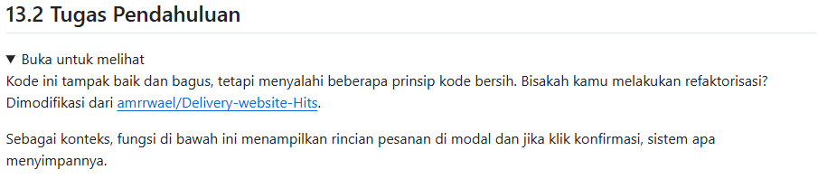
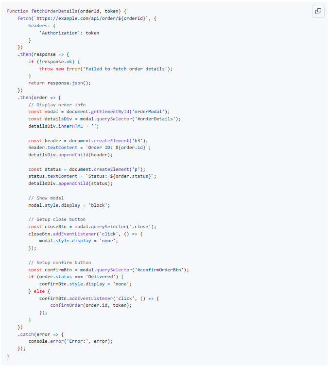

# Tugas Pendahuluan : Clean Code

Quratu Ayun Defaren

103122400064

SE-08-02

Dosen Pengampu : Yudha Islami Sulistya

Asisten Praktikum : Ardiansyah Muhammad Pradana Farawowan, dan Hamid Khaeruman 

## Soal

## Sumber Kode

Tersedia di [refaktori.js](refaktori.js)

## Penjelasan

perbaikannya:

1. tiap fungsi memiliki satu tugas
2. menggunakan async/await yang lebih mudah dibaca
3. menggunakan onclick sehingga listener lama tergantikan
4. Dipisahkan menjadi layer data dan presensi
5. setiap fungsi dapat diuji secara terpisah