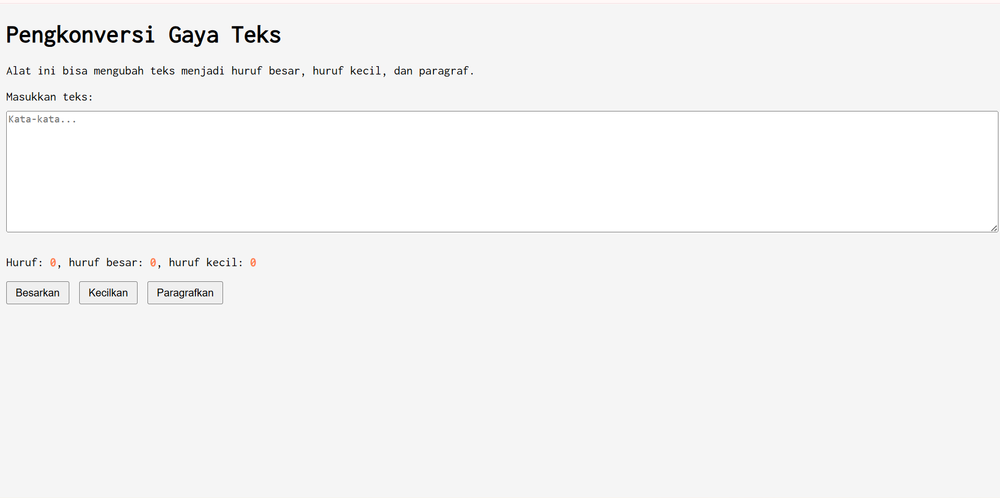

# Tugas Pendahuluan : GUI dengan HTML dan CSS

Quratu Ayun Defaren

103122400064

SE-08-02

Dosen Pengampu : Yudha Islami Sulistya

Asisten Praktikum : Ardiansyah Muhammad Pradana Farawowan, dan Hamid Khaeruman 

## Soal

Buatlah tata letak laman yang kamu buat berada di tengah seperti di bawah ini, dan juga ubah font-nya dengan Inconsolata dari Google Fonts.


## Sumber Kode

Tersedia di [index.html](./index.html) dan [index.css](./index.css)

## Output



## Deskripsi

Program ini mengkonversi gaya teks, button ```[Besarkan]``` untuk meng-caoslock kata-kata yang sudah diinputkan didalam kotak teks, ```[Kecilkan]``` untuk mengubah kata-kata tersebut huruf kecil semua, dan ```[Paragrafkan]``` untuk mengubah kata-kata tersebut menjadi paragraf, dimana setiap kata huruf awalnya kapital

Program ini juga bisa menghitung jumlah huruf ```[huruf = ...]``` baik huruf besar maupun huruf kecil, lalu ```[huruf besar = ...]``` untuk menghitung huruf besarnya saja, dan yang terakhir ```[huruf kecil = ...]``` untuk menghitung jumlah huruf kecil pada kata-kata

